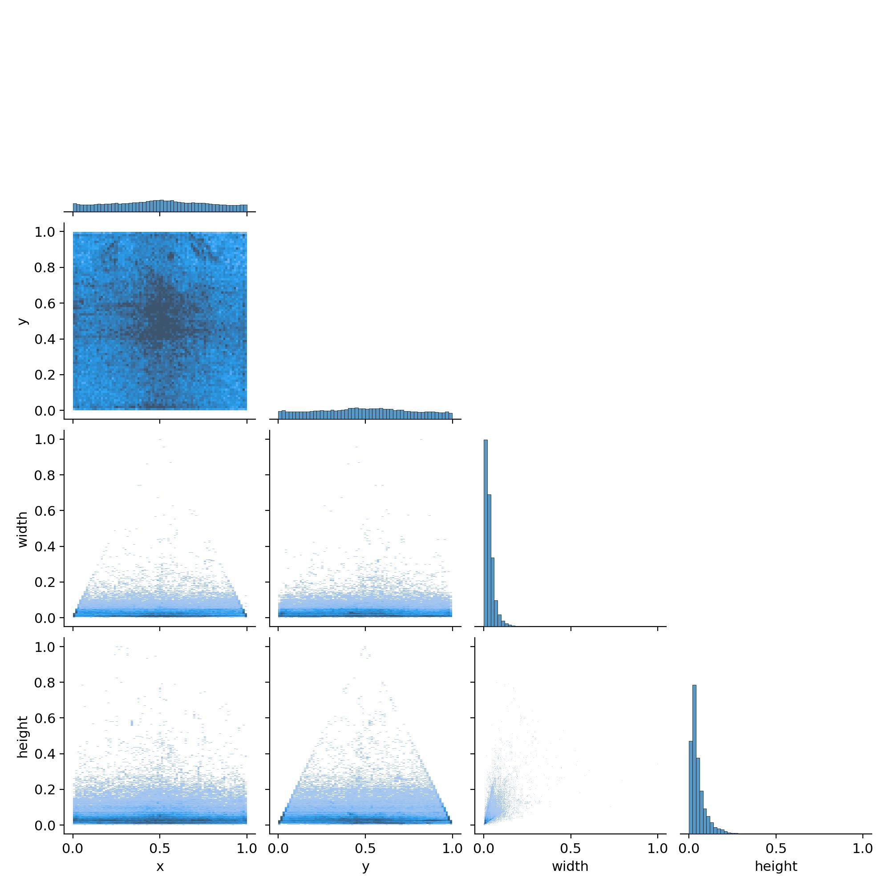

# Teknofest Yapay Zeka Yarışması Veri Seti

Bu depo, 2022 Teknofest Yapay Zeka Yarışması'nda birinci ve ikinci olan takımlarımızın kullandığı veri setini içerir. Toplamda 25.000 adede yakın kuş bakışı insan, taşıt, özel iniş alanı etiketleri içermektedir. Görseller stok video ve fotoğraflardan derlenmiştir.

## Biz Kimiz

Veri seti, Teknofest 2022 Ulaşımda Yapay Zeka Yarışması'nda birinci ve ikinci olan takımlar tarafından oluşturulmuştur. 

1. takımın lideri: Şevval Belkıs Dikkaya, 
2. takımın lideri: Muhammed İzzet Sezer
## Veri Seti Hakkında

Bu veri seti, ulaşım temalı 25.000'den fazla görüntü ve 1 milyondan fazla etiket içerir. Her bir görüntü, çeşitli ulaşım araçları, yollar, trafik işaretleri ve daha pek çok ulaşım ile ilgili özelliği içerir. Bu veriler, yapay zeka ve makine öğrenmesi uygulamalarının eğitiminde kullanılmıştır.

## Veri Setini Kullanma

### PASCAL VOC Formatı

PASCAL VOC formatı, genellikle görüntü sınıflandırma ve nesne tespiti için kullanılan yaygın bir veri formatıdır. Her görüntü için bir XML dosyası içerir. Bu XML dosyası, görüntüdeki nesnelerin etiketlerini, konumlarını ve boyutlarını içerir.

Bir PASCAL VOC XML dosyası genellikle aşağıdaki bilgileri içerir:

- `filename`: Görüntünün dosya adı.
- `size`: Görüntünün boyutu (genişlik, yükseklik, derinlik).
- `object`: Görüntüdeki her bir nesne için bir `object` öğesi bulunur. Her `object` öğesi aşağıdaki bilgileri içerir:
  - `name`: Nesnenin sınıf adı.
  - `bndbox`: Nesnenin sınırlayıcı kutusunun (bounding box) koordinatları (xmin, ymin, xmax, ymax).

### YOLO ile Kullanım

YOLO (You Only Look Once), gerçek zamanlı nesne tespiti için popüler bir algoritmadır. YOLO, PASCAL VOC formatındaki verileri kullanabilir, ancak verilerin YOLO'nun beklediği belirli bir formata dönüştürülmesi gerekmektedir. 

Aşağıdaki adımlar genel bir dönüştürme işlemine işaret etmektedir. Bu işlemler genellikle bir dönüştürme scripti ile yapılır:

1. Her bir görüntü için bir metin dosyası oluşturun. Metin dosyasının adı, görüntünün dosya adına karşılık gelmelidir.
2. Her bir metin dosyasında, görüntüdeki her bir nesne için bir satır olmalıdır. Her satır, aşağıdaki formatı izlemelidir:
```
<class id> <x_center> <y_center> <width> <height>
```

3. Bu değerler, görüntünün genişliği ve yüksekliğine göre normalize edilmelidir, yani tüm değerler 0 ile 1 arasında olmalıdır.
4. Dönüştürme tamamlandığında, veri seti YOLO'nun beklediği formatta hazır olacaktır.

YOLO ile eğitim yapmak için gerekli olan adımlar ve ayarlar farklı YOLO versiyonları ve uygulamaları arasında değişebilir, bu nedenle belirli bir YOLO versiyonu veya uygulaması için belgeleri ve talimatları kontrol etmenizi öneririz.


## Referans Verme

Eğer bu veri setini kendi çalışmanızda kullanırsanız, lütfen aşağıdaki gibi referans verin:

```
@misc{EflatunDataset,
author = {Şevval Belkıs Dikkaya, Muhammed İzzet Sezer},
title = {Eflatun Takımı Teknofest Ulaşımda Yapay Zeka Yarışması Veri Seti},
year = {2021},
publisher = {GitHub},
journal = {GitHub repository},
howpublished = {\url{https://github.com/sezer-muhammed/Teknofest-Ulasimda-Yapay-Zeka-Veri-Seti}},
}
```

Bu veri seti, yapay zeka topluluğuna ufak da olsa bir katkı sağlamaktadır. Umarız ki, bu veri seti üzerinde çalışmak sizi heyecanlandırır ve kendi projelerinizde kullanmaktan zevk alırsınız!


## Teşekkürler

Bu yarışma sürecinde bize büyük destek sağlayan Desird Ar&Ge ve Orema şirketlerine içtenlikle teşekkür ederiz.

## Lisans

Bu veri seti, [MIT Lisansı](LICENSE) altında yayınlanmıştır.

## İletişim

Herhangi bir sorunuz veya öneriniz olursa, lütfen [Issues](https://github.com/sezer-muhammed/Teknofest-Ulasimda-Yapay-Zeka-Veri-Seti/issues) bölümünü kullanarak bize bildirin.

## Öneriler

- Veri setini kullanırken dikkatli bir şekilde etiketleri inceleyin, bazı etiketler hatalı olabilir.
- Veri setini kullanmadan önce, verileri kendi projeniz için uygun formata dönüştürün.
- Bu veri seti üzerinde herhangi bir düzenleme veya iyileştirme yaparsanız, lütfen düzenlemelerinizi paylaşmayı düşünün.
## Veri Seti İstatistikleri



